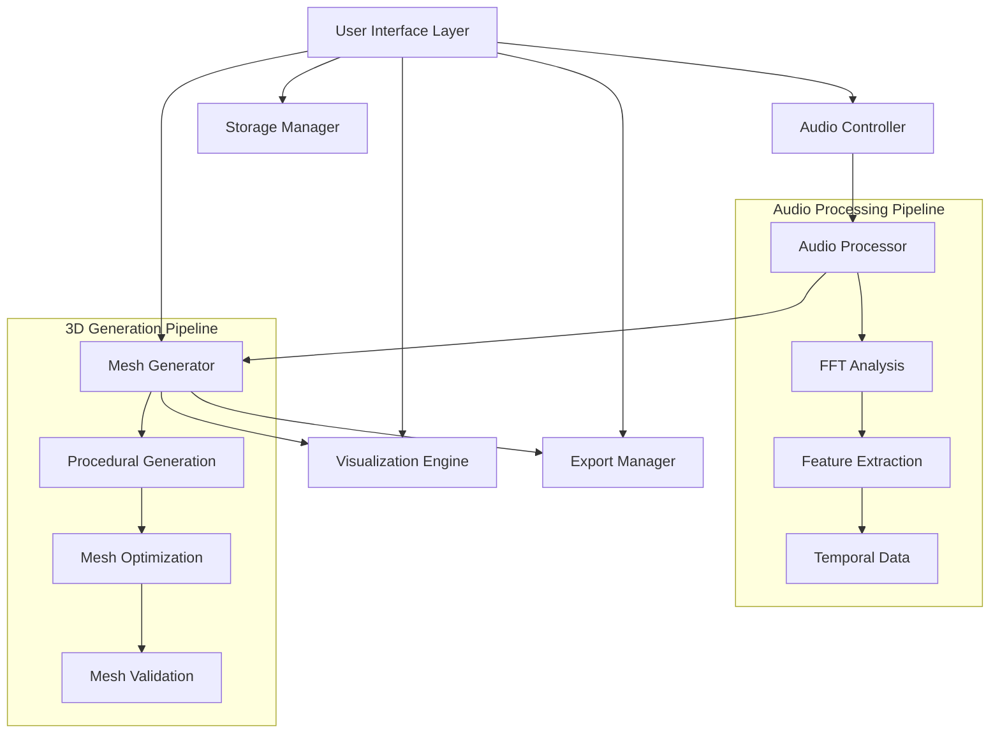

# Design Document

## Overview

The Sound Wave Sculptor is a web-based application that transforms audio data into three-dimensional sculptural forms through real-time audio analysis and procedural mesh generation. The system uses frequency domain analysis, amplitude mapping, and temporal pattern recognition to create unique 3D models that represent the sonic characteristics of input audio.

The application follows a modular architecture with separate concerns for audio processing, 3D mesh generation, visualization, and export functionality. The design prioritizes real-time performance, user interactivity, and compatibility with 3D printing workflows.

## Architecture



The system uses a pipeline architecture where audio data flows through analysis stages and feeds into 3D mesh generation, with real-time feedback to the visualization engine.

## Components and Interfaces

### Audio Controller
**Purpose**: Manages audio input sources and playback control
**Key Methods**:
- `loadAudioFile(file: File): Promise<AudioBuffer>`
- `startLiveCapture(duration: number): Promise<AudioBuffer>`
- `playAudio(buffer: AudioBuffer, onTimeUpdate: Function): void`
- `stopAudio(): void`

**Dependencies**: Web Audio API, MediaDevices API

### Audio Processor
**Purpose**: Analyzes audio data to extract sculptural features
**Key Methods**:
- `analyzeFrequencySpectrum(buffer: AudioBuffer): FrequencyData`
- `extractAmplitudeEnvelope(buffer: AudioBuffer): AmplitudeData`
- `getTemporalFeatures(buffer: AudioBuffer): TemporalData`
- `processRealTime(audioData: Float32Array): ProcessedFrame`

**Key Algorithms**:
- FFT using Web Audio API's AnalyserNode
- Windowing functions (Hann, Hamming) for spectral analysis
- Peak detection for rhythm and beat analysis
- Mel-frequency cepstral coefficients (MFCC) for timbral features

### Mesh Generator
**Purpose**: Converts audio features into 3D mesh geometry
**Key Methods**:
- `generateFromAudio(audioFeatures: AudioFeatures, params: SculptureParams): Mesh3D`
- `applyFrequencyMapping(frequencies: FrequencyData, mapping: FrequencyMapping): GeometryData`
- `createSurface(points: Point3D[], smoothing: number): Mesh3D`
- `optimizeForPrinting(mesh: Mesh3D): Mesh3D`

**Mapping Strategies**:
- **Frequency to Height**: Low frequencies → base structure, high frequencies → surface detail
- **Amplitude to Radius**: Volume variations control radial displacement from center axis
- **Temporal to Progression**: Time-based changes create sculptural flow along primary axis
- **Harmonic Content to Texture**: Overtone complexity influences surface roughness

### Visualization Engine
**Purpose**: Renders 3D models with real-time interaction
**Key Methods**:
- `renderMesh(mesh: Mesh3D, camera: Camera): void`
- `updateRealTime(audioFrame: ProcessedFrame): void`
- `handleUserInteraction(event: InteractionEvent): void`
- `animateWithAudio(audioBuffer: AudioBuffer, mesh: Mesh3D): void`

**Technology**: Three.js with WebGL renderer
**Features**: Orbit controls, lighting system, material shaders, animation timeline

### Export Manager
**Purpose**: Handles 3D model export and validation
**Key Methods**:
- `exportSTL(mesh: Mesh3D, scale: number): Blob`
- `exportOBJ(mesh: Mesh3D): {obj: Blob, mtl: Blob}`
- `validateForPrinting(mesh: Mesh3D): ValidationResult`
- `repairMesh(mesh: Mesh3D): Mesh3D`

**Validation Checks**:
- Manifold geometry verification
- Minimum wall thickness analysis
- Overhang detection for support requirements
- Volume and bounding box calculations

### Storage Manager
**Purpose**: Manages sculpture persistence and user collections
**Key Methods**:
- `saveSculpture(sculpture: Sculpture, metadata: SculptureMetadata): Promise<string>`
- `loadSculpture(id: string): Promise<Sculpture>`
- `getSculptureList(): Promise<SculptureMetadata[]>`
- `deleteSculpture(id: string): Promise<void>`

**Storage Strategy**: IndexedDB for client-side persistence with optional cloud sync

## Data Models

### AudioFeatures
```typescript
interface AudioFeatures {
  frequencyData: Float32Array[];     // FFT results over time
  amplitudeEnvelope: Float32Array;   // Volume changes over time
  spectralCentroid: Float32Array;    // Brightness measure
  spectralRolloff: Float32Array;     // High-frequency content
  zeroCrossingRate: Float32Array;    // Noisiness measure
  mfcc: Float32Array[];              // Timbral characteristics
  tempo: number;                     // Beats per minute
  key: string;                       // Musical key if detectable
}
```

### SculptureParams
```typescript
interface SculptureParams {
  frequencyMapping: {
    lowFreqToHeight: number;         // 0-1 influence factor
    midFreqToWidth: number;
    highFreqToDepth: number;
  };
  amplitudeMapping: {
    sensitivity: number;             // 0-1 amplitude response
    smoothing: number;               // Temporal smoothing factor
  };
  stylePreset: 'organic' | 'geometric' | 'abstract' | 'architectural';
  resolution: number;                // Mesh detail level
  symmetry: 'none' | 'radial' | 'bilateral';
}
```

### Mesh3D
```typescript
interface Mesh3D {
  vertices: Float32Array;            // XYZ coordinates
  faces: Uint32Array;               // Triangle indices
  normals: Float32Array;            // Surface normals
  uvs: Float32Array;                // Texture coordinates
  boundingBox: BoundingBox;
  volume: number;
  surfaceArea: number;
  isManifold: boolean;
}
```

## Error Handling

### Audio Processing Errors
- **File Format Errors**: Graceful fallback with format conversion suggestions
- **Decoding Errors**: Clear error messages with troubleshooting steps
- **Microphone Access**: Permission handling with alternative input methods
- **Processing Timeouts**: Progress indicators with cancellation options

### 3D Generation Errors
- **Memory Limitations**: Automatic resolution reduction with user notification
- **Invalid Geometry**: Automatic mesh repair with validation feedback
- **Export Failures**: Format-specific error handling with alternative export options

### User Experience Errors
- **Browser Compatibility**: Feature detection with graceful degradation
- **Performance Issues**: Automatic quality adjustment based on device capabilities
- **Storage Limits**: Quota management with cleanup suggestions

## Testing Strategy

### Unit Testing
- **Audio Processing**: Test FFT accuracy, feature extraction correctness
- **Mesh Generation**: Validate geometry algorithms, test edge cases
- **Export Functions**: Verify file format compliance, test with 3D printing software
- **Storage Operations**: Test CRUD operations, handle quota exceeded scenarios

### Integration Testing
- **Audio-to-Mesh Pipeline**: End-to-end processing with known audio samples
- **Real-time Performance**: Latency testing with live audio input
- **Cross-browser Compatibility**: Test on Chrome, Firefox, Safari, Edge
- **File Format Support**: Test with various audio formats and sizes

### User Acceptance Testing
- **Workflow Testing**: Complete user journeys from audio upload to 3D export
- **Usability Testing**: Interface responsiveness and intuitive controls
- **Performance Testing**: Test with different audio lengths and complexity
- **3D Print Validation**: Physical testing of exported models

### Performance Benchmarks
- **Audio Processing**: Target <2 seconds for 30-second audio clips
- **Mesh Generation**: Target <5 seconds for standard resolution
- **Real-time Visualization**: Maintain 30+ FPS during audio playback
- **Memory Usage**: Stay under 500MB for typical use cases